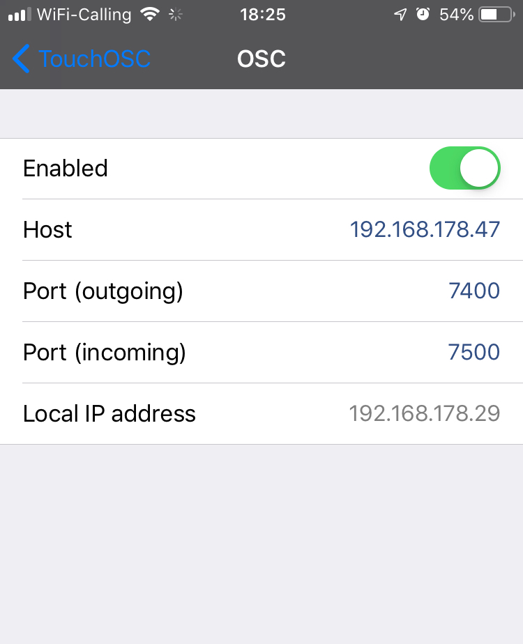

# data-streams/osc-bridge

An _OSC bridge server_, enabling bi-directional OSC messaging between
Websocket <-> UDP.

It is meant to be used by client apps, that use a Web Socket client
to receive/send OSC messages from/to a remote OSC controller, which
would only send/receive UDP datagrams.

## Setup

    $ npm install
    $ npm link

## Usage

    $ osc-bridge [ --auto-ping ]

## Configuration

### OSC bridge server

Before starting the _OSC bridge server_, you might want to tweak its configuration;
add following NPM environment variables in the `config` section of your `package.json`:

    {
      …,
      "config": {
        "osc-bridge": {
          "udp-server": {
            "host": "0.0.0.0",
            "port": "7400"
          },
          "udp-client": {
            "host": "192.168.xxx.yyy",
            "port": "7500"
          },
          "ws-server": {
            "host": "0.0.0.0",
            "port": "8080"
          }
        }
      },
      "devDependencies": {
        "osc-bridge": "latest",
        …
      }
      …
    }

See the [package.json](../../package.json) at the root of this monorepo
for an example.

### OSC remote controller

To send and receive OSC messages to/from the _OSC bridge server_, you will also
need to configure your remote _OSC controller app_.

Use the IP address of the network adapter listed by the _OSC bridge server_
upon start. For instance, if you get following output, your computer and
the _OSC bridge server_ will be reachable at IP `192.168.178.47`:

```
$ npm run dev:osc

> @petitatelier/data-streams@ dev:osc …
> osc-bridge & npm run dev && fg

OSC Websocket <-> UDP bridge server
Bridging OSC over Web Socket to/from `ws://0.0.0.0:8080`
Listening for OSC over UDP on `0.0.0.0:7400`
Broadcasting OSC over UDP to `192.168.178.29:7500`
Local host reachable at: [ en0: `192.168.178.47` ]

…
```

If you were using the popular [TouchOSC](https://hexler.net/software/touchosc)
_remote OSC controller app_, you would consequently configure it as following:



And in your `package.json`, you would adjust the `udp-client` host field
to the Local IP address `192.168.178.29` shown by TouchOSC:

```
{
  …
  "config": {
    "osc-bridge": {
      …
      "udp-client": {
          "host": "192.168.178.29",
          "port": "7500"
      }
      …
    …
  …
}
```